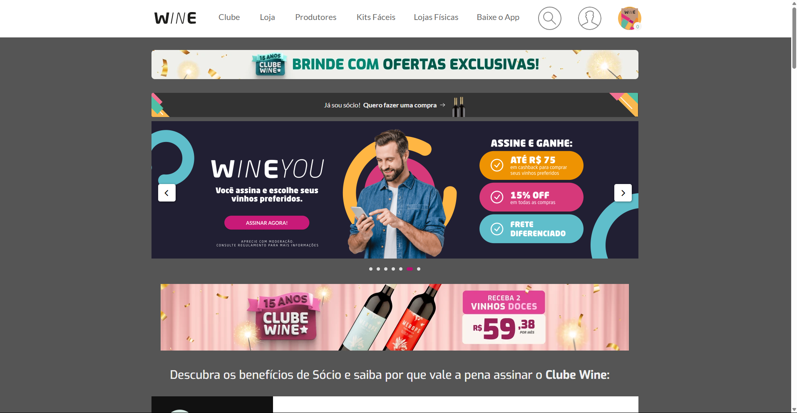

# Projeto: Remake de site/app web

Acesso: (https://elc1090.github.io/project1-2025a-andressateixeira13/)

#### Desenvolvedor(a)
Andressa Teixeira | Sistemas para Internet

#### Cliente
João Marcos

#### Site/app original

##### Link
https://www.wine.com.br/?srsltid=AfmBOorQdSJTjJUaRmu9cTmm4cF1MnvMZ0IkrKXITTLETaYHJpG9mue8

##### Descrição
A Wine é um e-commerce especializado em vinhos, oferecendo uma ampla variedade de rótulos nacionais e importados. O site possui um design moderno e intuitivo, facilitando a navegação e a experiência do usuário. Com identidade visual e imagens para destacar os produtos.

#### Demanda do(a) cliente
Um quadrado de promoções com a setinha como tem no inicio do site.
Produtos abaixo com o botão de adicionar (O que outros clientes estão comprando, o nome dessa seção)
Uma barrinha acima igual a do site, com as opções todas e afins relacionados (lembrando que não precisam funcionar os botões)

#### Desenvolvimento

Coleta de Conteúdo – Reuni e analisei o material original para definir com o cliente o que deveria ser mantido ou ajustado.

Planejamento – Estruturei a organização das informações e defini tecnologias.

Implementação – Desenvolvi o layout responsivo, estilização de acordo com o site e os  requisitos do cliente.

Testes e Ajustes – Verifiquei compatibilidade, responsividade e fiz melhorias conforme necessário.

#### Tecnologias

Substitua este trecho por uma lista detalhada de tecnologias usadas (tanto as básicas, como HTML e CSS, como as mais específicas, por exemplo Tailwind, etc.):
- HTML
- CSS

#### Ambiente de desenvolvimento
- VS Code
- Extensão Live Server

#### Referências e créditos
- https://codyhouse.co/
- https://developer.mozilla.org/pt-BR/docs/Web/CSS
- 

---
Projeto entregue para a disciplina de [Desenvolvimento de Software para a Web](http://github.com/andreainfufsm/elc1090-2025a) em 2025a
